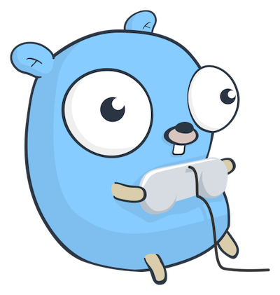

# The Y-machine

A Go package to emulate a simple computer system called the Y-machine.

- Following [John Arundel gmachine](https://github.com/bitfield/gmachine) tasks
- Will implement my own features later on

#### The reason I'm doing this it to learn more about golang and apply the Test-First approach of programming

### ToDo :

[ ] Add ci/cd pipeline to run tests upon pushing code to github
